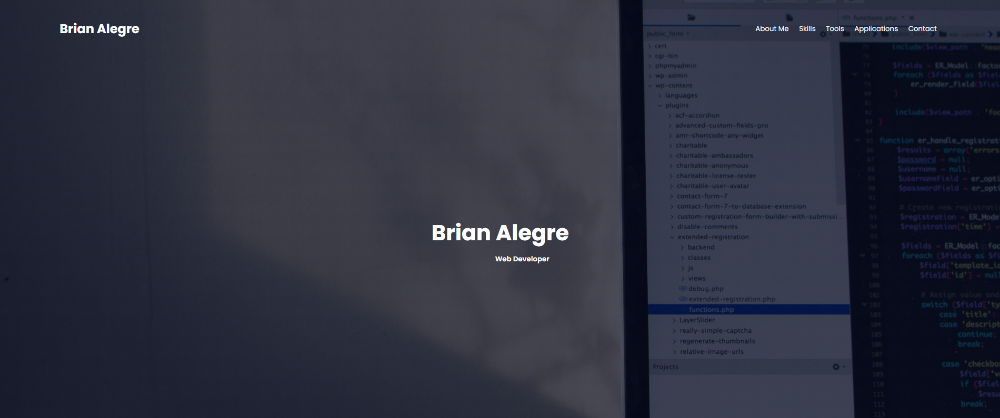

# 08-Update Portfolio

# Description

Update your Portfolio that was created back in week2 with your recent projects.

# Site Preview

    

# Github Links

-   Repository: https://github.com/brianalegre/08-Updated-Portfolio-Page
-   Deployed: https://brianalegre.github.io/08-Updated-Portfolio-Page/

# Requirements:

-   Developer's Name
-   Recent photo or avatar --> Done
-   Links to sections about them, work, or contact

-   Navigation links to section on the page --> Done
-   -   Scrolls to the section --> Done

-   Section with tilted images of develop's applications
-   -   First application image is bigger than the rest of the applications

-   Image application is clickable
-   -   Takes you to the deployed application

-   Mobile compatibility

## Acceptance Criteria

Here are the critical requirements necessary to develop a portfolio that satisfies a typical hiring manager’s needs:

WHEN I load their portfolio
THEN I am presented with the developer's name, a recent photo or avatar, and links to sections about them, their work, and how to contact them

WHEN I click one of the links in the navigation
THEN the UI scrolls to the corresponding section

WHEN I click on the link to the section about their work
THEN the UI scrolls to a section with titled images of the developer's applications

WHEN I am presented with the developer's first application
THEN that application's image should be larger in size than the others

WHEN I click on the images of the applications
THEN I am taken to that deployed application

WHEN I resize the page or view the site on various screens and devices
THEN I am presented with a responsive layout that adapts to my viewport
